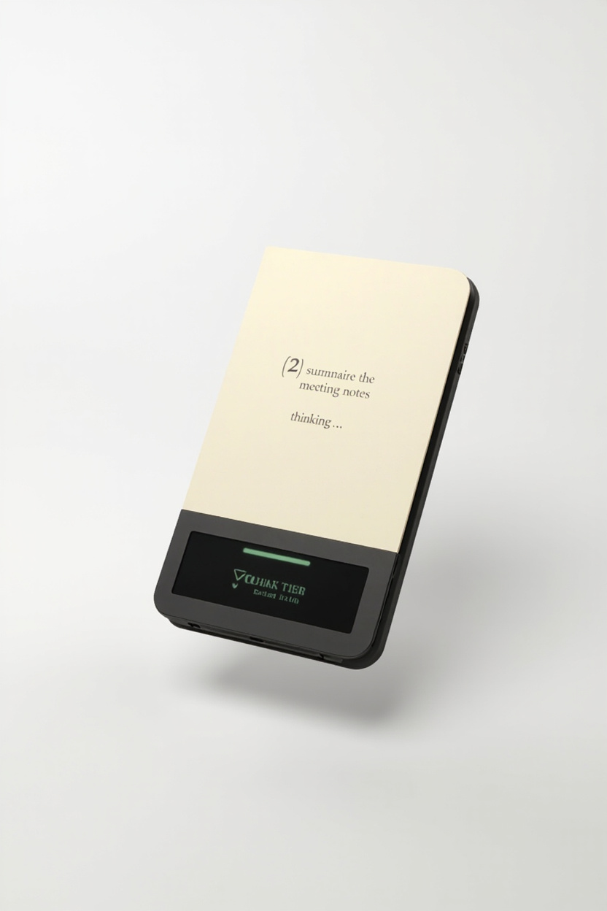
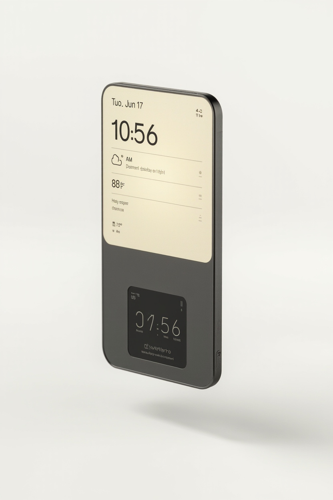

# SmartLife Pocket — Device Mockup v1

> Visual concept for the **Pocket** Companion. Two screens stacked. No housing, no bezel art — just the displays and a basic UI, in multiple states, so we can nail down the visual language before committing to a form factor.
> **Status: v1 draft (2026-06-17).** Awaiting Josh's reaction.

## Hero renders

Two rendered concepts in `heroes/` — the killer use case (AI chat, OLED active) and the calm default (idle, OLED at rest):




*Image generators mangle small text on the OLED (e.g., the prompt arrow and OLED labels are slightly off) — the visual *concept* is what matters, not the literal text rendering.*

## 0. The Macbook parallel — be precise

There are two "Macbook bar" patterns and they teach different lessons:

| Pattern | What it was | Lesson |
|---|---|---|
| **Macbook Touch Bar** (2016–2021, deprecated) | Full-width thin OLED strip *replacing* the function keys | **Don't do this.** Constantly changing content in a primary touch zone was fatiguing and hard to discover. Strip was always-on, always-doing-something. |
| **Macbook notch / iPhone Dynamic Island** (current) | Small centered pill that **grows contextually** for active content | **This is the model.** Centered, intentional, mostly idle, only takes space when something needs the user's attention. |

For SmartLife Pocket the OLED strip should be a **Dynamic Island**, not a Touch Bar:

- It's **off by default** (matches design system §refresh — OLED wakes only on active events)
- It's **centered, not full-width** (no width-matching problem, no constant presence)
- It's **contextual** (status pills when idle, token stream when AI is thinking, waveform when voice is active)
- It can **grow / shape-shift in software** to fit the content (Dynamic Island-style expansion)

This solves the width-matching concern: a 4"-wide e-ink panel does not need a 4"-wide OLED. A **2.0" or 2.4" OLED centered below the e-ink** is sleeker, easier to source, and more on-brand.

## 1. Three layout options considered

```
   OPTION A — Centered "Island" (RECOMMENDED)         OPTION B — Full-width bottom strip
   ┌──────────────────────────┐                       ┌──────────────────────────┐
   │                          │                       │                          │
   │                          │                       │                          │
   │     E-INK (4 × 6)        │                       │     E-INK (4 × 6)        │
   │     main canvas          │                       │     main canvas          │
   │     1200 × 1800 @ 300ppi │                       │     1200 × 1800 @ 300ppi │
   │                          │                       │                          │
   │                          │                       │                          │
   ├──────────────────────────┤                       ├──────────────────────────┤
   │      ┌────────────┐      │                       │     OLED (4 × 0.5)       │
   │      │  OLED      │      │                       │     800 × 100  @ 200ppi  │
   │      │  (2.4×0.5) │      │                       │     full-width status    │
   │      └────────────┘      │                       │                          │
   └──────────────────────────┘                       └──────────────────────────┘
       ~ 4" wide × ~7" tall                              ~ 4" wide × ~7" tall
       sources: 2.0", 2.4" OLEDs (common)                sources: custom or 2× stacked
       sleek: yes                                        sleek: needs perfect width match


   OPTION C — Top status bar (rejected for Pocket)
   ┌──────────────────────────┐
   │     OLED (4 × 0.3)       │ ← top, phone-style status bar
   ├──────────────────────────┤
   │                          │
   │     E-INK (4 × 6)        │
   │                          │
   │                          │
   │                          │
   │                          │
   └──────────────────────────┘
   Sources: same as B
   Rejected for Pocket: too easy to lose in a sun hat / pocket /
                        held low / in motion. Bottom is more glanceable.
                        Commander may use this instead.
```

**Why Option A wins:**
1. **Width-matching is a non-issue.** A 2.4" OLED centered in a 4" e-ink leaves clean bezel zones on either side. No custom OLEDs, no stacked displays, no "almost-but-not-quite" alignment.
2. **Off by default works better with a smaller surface.** The OLED is asleep most of the time — a centered pill is less visually demanding than a full-width strip that's empty.
3. **Dynamic Island-style growth is the right vocabulary.** Small when idle (status pills), expands to fit token stream / waveform / notification content.
4. **Sourcing is realistic.** 2.0" and 2.4" OLEDs are off-the-shelf (SSD1309, SH1106, SSD1351 variants). 4"-wide OLEDs at 100ppi+ are not.

**What A costs:** the OLED "island" can't show as much at once. We trade surface area for sleekness. The OLED is for **transient** content only (token streams, waveforms, status ticks, brief notifications). Anything that needs to be read lives on the e-ink.

**B is the fallback if A proves too small in practice.** We've designed the routing rules to work on both.

## 2. UI states on Option A (the recommended layout)

The "device" view below is the two-screen stack. E-ink on top, OLED island below. Each state shows what the e-ink is doing (refresh mode) and what the OLED is doing (active / idle).

### State 1 — Idle (the default)

```
┌────────────────────────────────────┐ ← e-ink (full refresh on unlock,
│                                    │    partial on minute tick)
│   Tue  Jun 17                     │
│   10:56 AM                        │
│                                    │
│   San Antonio  88°F  ☀            │
│   "Partly cloudy, light breeze"   │
│                                    │
│   ─────────────────────────       │
│                                    │
│   Up next                         │
│   • 2:00 PM   Sprint planning     │
│   • 4:30 PM   Pickup groceries    │
│                                    │
│   ─────────────────────────       │
│                                    │
│   Home: 3 lights on, 1 door open  │
│                                    │
│                                    │
│                       [ Ask ▸ ]   │ ← button
│                                    │
├────────────────────────────────────┤
│       ┌──────────────────┐         │ ← OLED: idle, low-power
│       │  78%   ▂▃▄▅█     │         │    showing battery + signal
│       │  ☀ 12:56   ◐    │         │
│       └──────────────────┘         │
└────────────────────────────────────┘
```

E-ink: static, partial refresh on the clock minute. OLED: idle status pills, dim.

### State 2 — Reading a note

```
┌────────────────────────────────────┐
│   < Notes                          │
│   ───────────────                  │
│                                    │
│   Meeting 2026-06-16               │
│   ──────────────                   │
│   Reviewed v1 BOM.  Decisions:     │
│   • panel SKU pending              │
│   • Lyra bring-up next week        │
│   • friend can print enclosures    │
│                                    │
│   Action items                     │
│   ──────────────                   │
│   [ ] confirm panel vendor         │
│   [ ] sketch enclosure language    │
│   [ ] ping friend re: bed size     │
│                                    │
│   (still in progress)              │
│                                    │
│                                    │
│                                    │
├────────────────────────────────────┤
│       ┌──────────────────┐         │
│       │  78%   ▂▃▄▅█     │         │ ← OLED: same idle status
│       │  ☀ 12:56   ◐    │         │
│       └──────────────────┘         │
└────────────────────────────────────┘
```

E-ink: full refresh on open, partial on scroll. OLED: untouched.

### State 3 — AI thinking (just after the user submits a prompt)

```
┌────────────────────────────────────┐
│                                    │
│   > summarize the meeting notes    │ ← user prompt (committed)
│                                    │
│   ──────────────                   │
│                                    │
│   thinking…                        │ ← e-ink: "thinking…" label,
│                                    │    partial refresh
│   (offline · local model)          │
│                                    │
│                                    │
│                                    │
│                                    │
│                                    │
│                                    │
│                                    │
│                                    │
├────────────────────────────────────┤
│       ┌──────────────────┐         │
│       │  ▒▒▒▒▒▒▒▒▒░░░░   │         │ ← OLED: token counter fills
│       │     tokens: 12   │         │    live, animated progress
│       │     ETA: ~2s     │         │
│       └──────────────────┘         │
└────────────────────────────────────┘
```

E-ink: one partial refresh to show "thinking…", then no flashing. OLED: live progress + ETA.

### State 4 — AI streaming

```
┌────────────────────────────────────┐
│                                    │
│   > summarize the meeting notes    │
│                                    │
│   thinking…                        │ ← e-ink unchanged
│   (offline · local model)          │
│                                    │
│                                    │
│                                    │
│                                    │
│                                    │
│                                    │
│                                    │
│                                    │
│                                    │
│                                    │
├────────────────────────────────────┤
│       ┌────────────────────────┐   │
│       │  Meeting covered the   │   │ ← OLED: tokens stream live
│       │  v1 BOM, enclosure     │   │    at 30–60Hz
│       │  timeline, and pane…   │   │
│       │  ▏              87/142 │   │
│       └────────────────────────┘   │
└────────────────────────────────────┘
```

E-ink: not flashing, just waiting. OLED: live token stream + counter. OLED "grows" to fit the content (Dynamic Island style).

### State 5 — AI reply complete (full refresh on e-ink)

```
┌────────────────────────────────────┐
│                                    │
│   > summarize the meeting notes    │
│                                    │
│   ──────────────                   │
│                                    │
│   Meeting covered the v1 BOM,     │ ← e-ink: full refresh
│   enclosure timeline, and panel    │    shows the final reply
│   sourcing. Action items:          │
│   • confirm panel SKU              │
│   • sketch enclosure language      │
│   • ping friend about print bed    │
│                                    │
│   42s · local · no offload         │
│                                    │
│   [ Ask follow-up ]   [ Done ]     │
│                                    │
│                                    │
│                                    │
│                                    │
├────────────────────────────────────┤
│       ┌──────────────────┐         │
│       │  78%   ▂▃▄▅█     │         │ ← OLED: back to idle
│       │  ☀ 12:57   ◐    │         │
│       └──────────────────┘         │
└────────────────────────────────────┘
```

E-ink: single full refresh to commit the reply. OLED: returns to idle (or shows "last reply · 1m ago" briefly, then idle).

### State 6 — Voice listening

```
┌────────────────────────────────────┐
│                                    │
│   "summarize the meeting notes"    │ ← e-ink: transcript as it
│                                    │    stabilizes (commits per
│   (push-to-talk, hold side btn)    │    phrase, partial refresh)
│                                    │
│                                    │
│                                    │
│                                    │
│                                    │
│                                    │
│                                    │
│                                    │
│                                    │
│                                    │
│                                    │
├────────────────────────────────────┤
│       ┌────────────────────────┐   │
│       │  ▁▂▃▅▇▇▅▃▂▁▂▃▅▇▅▃▂▁   │   │ ← OLED: live waveform
│       │     listening…          │   │    30–60Hz
│       └────────────────────────┘   │
└────────────────────────────────────┘
```

E-ink: per-phrase commits, not per-word. OLED: live waveform, no flashing on e-ink.

### State 7 — Typing in a note

```
┌────────────────────────────────────┐
│                                    │
│   Meeting 2026-06-16               │
│   ──────────────                   │
│   Reviewed v1 BOM.  Decisions:     │
│   • panel SKU pending              │
│   • Lyra bring-up next week        │
│   • friend can print enclosures    │
│                                    │
│   Action items                     │
│   ──────────────                   │
│   [x] confirm panel vendor         │ ← user is typing here
│   [ ] sketch enclosur|e            │   (cursor at "|")
│                                    │
│   (3 more items)                   │
│                                    │
│                                    │
│                                    │
├────────────────────────────────────┤
│       ┌──────────────────┐         │
│       │  e               │         │ ← OLED: keystroke echo
│       │  ⌨ typing…       │         │    (last key shown, fades)
│       └──────────────────┘         │
└────────────────────────────────────┘
```

E-ink: spot refresh on cursor move + per-character commit (debounced). OLED: tiny keystroke echo + typing indicator. The e-ink doesn't flash on every key — only on commit boundaries.

### State 8 — Home Assistant glance

```
┌────────────────────────────────────┐
│                                    │
│   Home                             │
│   ─────                            │
│                                    │
│   Living room  Lamp      ● on      │
│   Kitchen     Light     ○ off      │
│   Garage      Door      ▲ open     │ ← uses icon + color + word,
│   Front door  Lock      ● locked   │    not color alone
│   Bedroom     Thermostat 72°F      │
│   Backyard    Camera    ● armed    │
│   Office      Plug      ● on       │
│                                    │
│   7 of 12 normal                   │
│                                    │
│              [ Run scene ▸ ]       │
│                                    │
├────────────────────────────────────┤
│       ┌──────────────────┐         │
│       │  ▂▃▄▅▆  home  ●  │         │ ← OLED: connection state
│       │       net ok     │         │    to Home Base
│       └──────────────────┘         │
└────────────────────────────────────┘
```

E-ink: list of entities with state pills. OLED: connection state to Home Base.

### State 9 — Sleep (M0 co-processor alive, both displays off)

```
┌────────────────────────────────────┐
│                                    │
│                                    │
│                                    │ ← e-ink holds the last image
│                                    │    with zero power
│                                    │
│                                    │
│                                    │
│                                    │
│                                    │
│                                    │
│                                    │
│                                    │
│                                    │
│                                    │
│                                    │
├────────────────────────────────────┤
│                                    │ ← OLED: completely off
└────────────────────────────────────┘
   ↑
   wake on: physical button, scheduled alarm, mesh event
```

The whole device is at "weeks/months standby" power. The last image stays on the e-ink. OLED draws nothing. M0 watches for wake sources.

## 3. Width-matching — how A solves it

Josh's concern: "parts aren't available of the same width (assuming an eink display 4×6in, and an oled strip 4×1in or something)."

Option A's answer: **they don't have to match.** The OLED is a centered island, not a strip. The dimensions are decoupled.

| e-ink width | OLED candidate | Why it works |
|---|---|---|
| 4" | **2.4" centered** | Common off-the-shelf (2.0", 2.4", 2.8" all available). Bezel on either side reads as intentional design. |
| 5" | **2.8" or 3.2" centered** | Larger pool of OLEDs at this size. |
| 6" | **3.5" or 4.0" centered** | Some color OLEDs (SSD1351) at this size if we ever want color status. |

**The design language is "centered island below the canvas" — not "matching strips."** That's actually more on-brand (Dynamic Island reference) and easier to manufacture. The OLED is a **deliberate feature**, not a strip that happens to be the same width.

If we *want* a full-width strip later, we can use two stacked 2.4" OLEDs side by side, or a custom-width long bar. But the centered island is the default recommendation.

## 4. What this mockup locks in (when confirmed)

- **Two displays on Pocket**: e-ink main canvas + centered OLED island below
- **OLED is a Dynamic Island, not a Touch Bar**: off by default, contextual, growable
- **Centered, not full-width**: solves the sourcing problem; reads as intentional design
- **E-ink: 4–6" portrait, 4" being the pocket-friendly default**
- **OLED: 2.0–2.4" centered, common off-the-shelf**
- **Physical placement: below the e-ink** (top is rejected for Pocket; Commander may use top — see §5)
- **Refresh policy as documented in `ui/DESIGN-SYSTEM.md` §5** — one full refresh per screen, partial for in-app, spot for typing echo, OLED off by default

## 5. Open questions for the visual concept

- **OLED placement**: bottom (recommended) vs top (phone-style) vs both ends. Pending Q17 (industrial design direction).
- **OLED color vs mono**: mono is cheaper and lower power; color helps with status colors. Default v1: **mono** with thoughtful use of inverted regions for "alert" states.
- **OLED growable?** The Dynamic Island expands; should the SmartLife OLED? Default: **yes, in software** — single-line when idle, multi-line when active. Width stays fixed; height grows.
- **Commander's OLED**: should Commander have one too, or stay pure e-ink? Recommendation: **stay pure e-ink** — Commander is the always-glanceable device, no live feedback needed.
- **Hero render**: want me to generate a polished rendered image of the recommended layout with one or two of the states above? Can do that next; ASCII is for showing the structure quickly.

## 6. Next artifacts to produce

In order, before any hardware decisions:

1. **Confirm or push back on the layout in §1** — Option A vs B vs C
2. **Decide on the OLED specs** (size, color/mono, interface) — see §5
3. **One or two hero renders** with `image_generate` — visual polish
4. **First full Pocket screen set** in the design language (home, AI chat, notes, HA, settings) — more detail than the states above
5. **Refresh policy table** — concrete "this widget, this mode" reference
6. **Button map** — concrete D-pad / select / back / home / voice / power bindings
